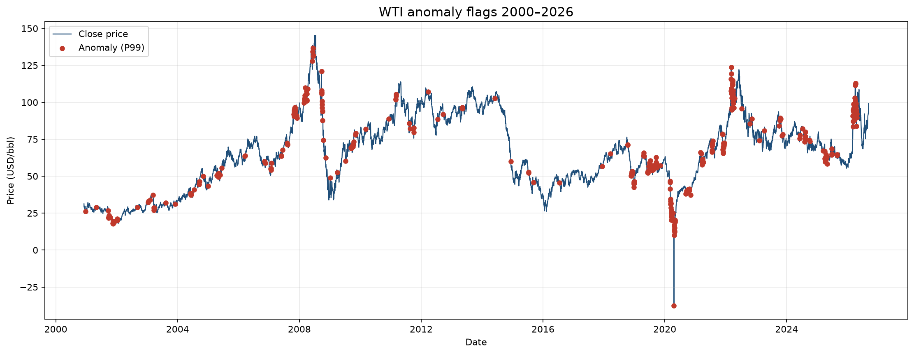

# Anomaly Detection in WTI Crude Oil Prices

West Texas Intermediate (WTI) is a primary benchmark for global crude oil. Large, unexpected moves in its daily price — the 2008 collapse, the 2015–2016 downturn, March 2022, or 20 April 2020, when the contract settled below zero for the first time — are the observations that matter for hedging and energy risk. This project asks whether those days can be recovered from the price history alone, without a labelled list of “events”.

The model is an **LSTM autoencoder**. It reads a window of ten consecutive closing prices and is trained only to reconstruct that window. On typical trading days the copy is close. When the path of prices leaves the pattern the network has learned, the reconstruction error increases. Days whose error exceeds a statistical threshold (the 90th percentile of training error) are treated as anomalies.

The figure uses the production model on the full WTI futures series (Yahoo Finance ticker `CL=F`). The highest reconstruction error is 20 April 2020 (close −$37.63). The same scoring also highlights late 2008, the 2015–2016 oil bust, and the March 2022 spike.



## How this repository is organised

| Folder | Contents |
| --- | --- |
| **[Production/](Production/)** | Training pipeline, saved Keras model, scores and figures. This is the version to run and to review. |
| **[R&D/](R&D/)** | Original Jupyter notebook, Keras `.h5` weights and the first research plots. |

```bash
cd Production
python src/pipeline.py --mode evaluate
```

Setup, architecture and commands: [Production/README.md](Production/README.md).  
Module-level reference: [Production/DOCUMENTATION.md](Production/DOCUMENTATION.md).

## Data

Prices come from [yfinance](https://github.com/ranaroussi/yfinance) (`CL=F`, period `max`, unadjusted close).

## License

MIT. See [LICENSE](LICENSE).
